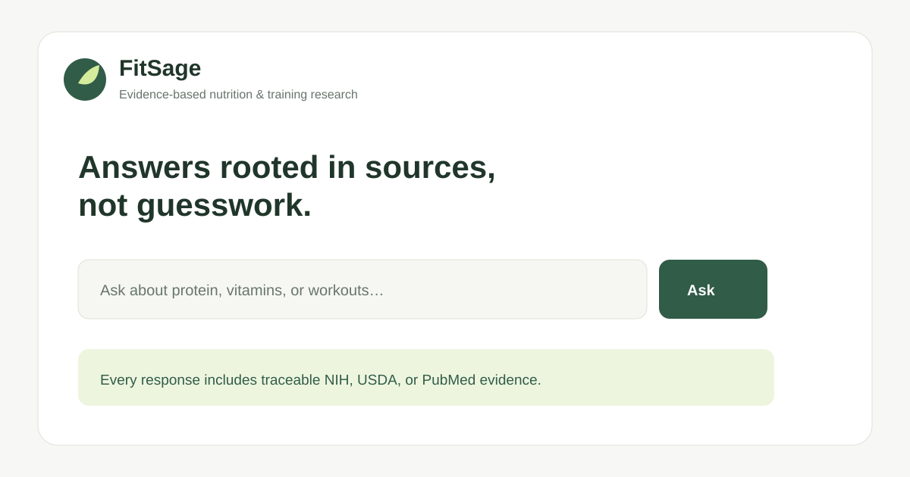

# FitSage

FitSage is a citation-first nutrition and workout research assistant. It answers only from a curated NIH, USDA, and PubMed corpus, shows the evidence used, and declines to make personal medical diagnoses.



## What is included now

- A polished FastAPI web demo that runs with **no API keys**.
- Local, inspectable retrieval over a small vetted starter corpus.
- Source links, evidence excerpts, domain guardrails, and a health-information disclaimer.
- A reproducible labeled retrieval evaluation and a keyword baseline.
- A clean adapter boundary for OpenAI + Pinecone + LangChain when credentials are added.

## Run locally

```bash
python3 -m venv .venv
source .venv/bin/activate
pip install -r requirements.txt
uvicorn app.main:app --reload
```

Open `http://127.0.0.1:8000`.

## Test and evaluate

```bash
pytest
python scripts/evaluate.py
```

The evaluation output is intentionally not pre-filled. Run it after any corpus or retrieval change, save the result, and report the measured number—not a target—as a resume claim.

## Production integration checklist

The application starts in `APP_MODE=demo` and never needs credentials for a demo. To enable a live RAG pipeline:

1. Copy `.env.example` to `.env`; keep it out of Git.
2. Install `pip install -r requirements-ai.txt`.
3. Add a project-scoped `OPENAI_API_KEY` and a Pinecone Starter key/index name.
4. Run an ingestion job that chunks approved NIH, USDA, and PubMed content, embeds it, and upserts it with its URL/title metadata.
5. Implement and test the `LiveRAGService` in `app/services/live_rag.py`; the local `DemoRAGService` is intentionally retained as an offline fallback.
6. Re-run `python scripts/evaluate.py` on a held-out labeled set and record the exact methodology, sample size, and score.

The API key must remain server-side. The official OpenAI quickstart shows Python's SDK reading `OPENAI_API_KEY` from the environment, which is the pattern FitSage follows. [OpenAI Developer quickstart](https://developers.openai.com/api/docs/quickstart)

## API

`POST /api/ask`

```json
{"question": "How much vitamin D do adults aged 19–70 need?"}
```

The response contains an answer, evidence passages, citations, mode, and a safety note. API documentation is available at `/docs`.

## Architecture

```text
Browser UI → FastAPI → RAG service → retrieval → curated sources
                              └── demo: local corpus
                              └── live: LangChain → Pinecone → OpenAI
```

## Responsible-use notes

FitSage is educational software, not a substitute for a clinician or dietitian. It does not calculate individualized treatment plans, diagnose conditions, or provide emergency advice. The production ingestion pipeline must store source metadata and preserve citations for every chunk.

