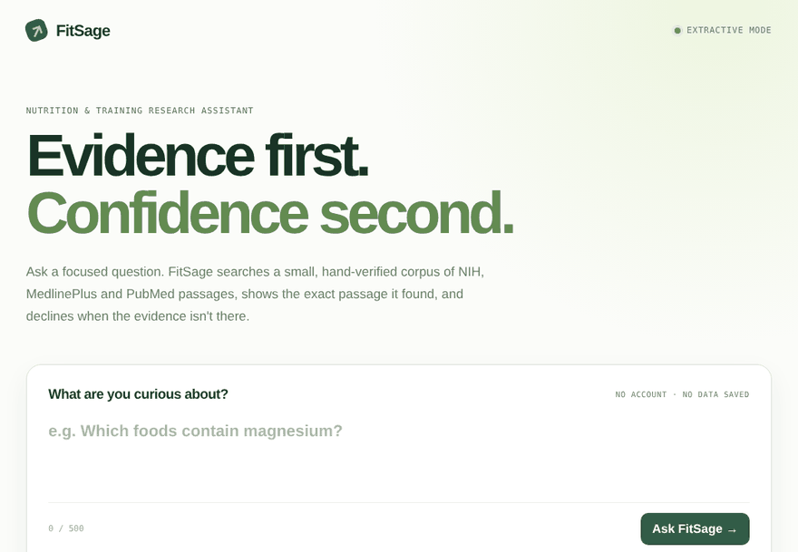

# FitSage

Citation-first retrieval for nutrition and exercise questions. Ask a question and FitSage returns the exact NIH, MedlinePlus or PubMed passage that answers it, with a link to the page, or says it has no evidence when the corpus can't answer.



[Watch the MP4](docs/demo.mp4). Both files are recorded from the running app by `scripts/record_demo.py`: real questions, real responses, no mock-ups.

## What it is, and what it isn't

- **Is:** a small retrieval system you can read end to end. Hybrid lexical + latent-semantic ranking over **54 short passages from 15 sources**, an abstention threshold, rule-based guards for urgent and personal-medical questions, a FastAPI service and a single-page UI.
- **Default answers are verbatim.** The answer shown is the top retrieved passage, unchanged. Nothing is generated, so the text itself can't be hallucinated; the risk is retrieving the wrong passage (see the failure list below). It also can't synthesise across passages.
- **Isn't:** an LLM chatbot (an optional LLM answer writer exists but is off by default and not evaluated), a neural-embedding or vector-database system, or medical advice. There is no OpenAI, Pinecone or LangChain dependency in the default install.

## Run it

```bash
python3 -m venv .venv && source .venv/bin/activate
pip install -r requirements.txt
uvicorn app.main:app --reload       # http://127.0.0.1:8000, API docs at /docs
pytest                              # 20 tests
```

`POST /api/ask` with `{"question": "..."}` returns `answer`, `sources` (passage text, section, link, match score), `mode` (`extractive` or `declined`), and a safety note.

## How it works

```text
question ──► guards (urgent / personal-medical) ──► BM25F ranking ─┐
                                                    LSA ranking  ──┴─► rank fusion (RRF)
                                                                         │
                          confidence = IDF-weighted share of query terms found in the top passage
                                                                         │
                                  below threshold ► decline      above ► show passage + 2 related, with links
```

- **BM25F** scores stemmed query terms against passage text, section heading and source title, with per-field weights.
- **LSA** is TF-IDF → truncated SVD → cosine. With 48 components over 54 passages it sits close to a TF-IDF cosine retriever; it is *not* a learned embedding and generalises to paraphrases only weakly.
- **Abstention:** if the top passage covers too little of the query's rare terms, FitSage declines instead of guessing. The threshold was chosen on the tuning set with a safety-first loss (a wrong or out-of-corpus answer costs 2× a needless refusal).
- **Guards** for urgent phrases and requests to assess your own symptoms are plain regular expressions. They are covered by unit tests but were **not** part of the retrieval evaluation.

## Corpus

54 passages from 15 pages: NIH Office of Dietary Supplements fact sheets (vitamin D, magnesium, iron, calcium, zinc, vitamin B12, omega-3, potassium, and supplements for exercise and athletic performance), one NIH MedlinePlus page on exercise, and five PubMed abstracts (protein and resistance training, training volume, training frequency, creatine, protein position stand). See `app/data/corpus.json`.

Every passage was checked on 2026-10-04 against the rendered text of its source page: whitespace-normalised, bracketed citation numbers removed, exact substring match. Passages taken from tables or bullet lists are flattened exactly as the page renders them and marked `kind: table|list`; the UI labels them. The check was run with an equivalent in-browser script. `scripts/verify_corpus.py` implements the same check for re-running (it needs a headless browser, and some sites block automated browsers, so pages can show as UNREACHABLE); it has been tested against a local fixture page but not yet against the live sites.

Earlier versions of this repo contained paraphrased snippets and USDA MyPlate passages. A re-check found paraphrases that weren't on the source pages, and MyPlate blocks automated browsers so its text could not be verified. Both were removed; there is currently **no USDA content**.

## Evaluation

All numbers below are produced by `python scripts/evaluate.py` and stored in `evaluation/results.json`.

**Setup.** 54 held-out test questions (39 answerable, each labelled with the passage(s) that answer it, and 15 the corpus cannot answer). Hyper-parameters and the abstention threshold were tuned only on a separate 60-question tuning set (`evaluation/queries_dev.json`) by `scripts/tune.py`. Metrics: **top-1** = the top-ranked passage is a labelled answer (before any abstention); **MRR@5** = mean reciprocal rank of the first labelled passage within the top 5.

| System | Top-1 (95% CI) | Top-3 | MRR@5 | Declined out-of-corpus questions (of 15) | Refused answerable questions (of 39) |
|---|---|---|---|---|---|
| Keyword overlap — the original FitSage baseline | 66.7% (26/39), CI 51–79% | 71.8% | 0.719 | 13/15 | 15/39 |
| BM25, plain text | 66.7% (26/39), CI 51–79% | 84.6% | 0.756 | 13/15 | 15/39 |
| BM25F + stemming + section/title fields | 87.2% (34/39), CI 73–94% | 94.9% | 0.912 | 12/15 | 7/39 |
| LSA only | 89.7% (35/39), CI 76–96% | 94.9% | 0.929 | 11/15 | 7/39 |
| **Hybrid (BM25F + LSA, rank fusion) — what the app uses** | 92.3% (36/39), CI 80–97% | 97.4% | 0.940 | 12/15 | 6/39 |

- Hybrid vs the original keyword baseline: **92.3% vs 66.7% top-1**, a difference of +25.6 points (paired-bootstrap 95% CI +12.8 to +41.0).
- Hybrid vs BM25F alone: +5.1 points (CI +0.0 to +12.8). **That difference is borderline: the interval's lower end is 0.** Most of the gain over the baseline appears to come from stemming, section/title field weighting and parameter tuning (the BM25 → BM25F row), not from the LSA component.
- With the abstention threshold applied, the hybrid shows an answer for 36/54 test questions; 6/36 of those answers are wrong or answer an out-of-corpus question. It declines 12/15 out-of-corpus questions and needlessly refuses 6/39 answerable ones. Failures are listed in `evaluation/results.json` under `hybrid_failures`.

**Read these numbers with care.**

- 39 answerable test questions on a 54-passage corpus is small; the confidence intervals are wide.
- Questions were written by the project's authors, not collected from users, and often share key terms with the passages.
- The test set has a history. A first test set was used during development and was then merged into the tuning set. The reported test set was written afterwards and frozen before the final tuning. When USDA content was removed, the 6 test questions that depended on it were deleted (a change driven by the corpus, not by results), and the retriever was re-tuned on the tuning set. `results.json` records the SHA-256 of the test file as evaluated.
- Because default answers are verbatim passages, there is no answer-faithfulness metric. The retrieval metrics are the only measurements here; the optional LLM writer has not been evaluated.

## Optional: LLM answer writer

Set `GENERATION=openai`, `OPENAI_API_KEY` and `OPENAI_MODEL` (and `pip install -r requirements-ai.txt`). The model sees only the retrieved passages and must cite their ids; any answer that cites a passage that wasn't retrieved, cites nothing, or says the evidence is insufficient is discarded in favour of the verbatim answer. The guard logic is unit-tested against a fake client. **It has not been run against the real API in this repository's tests or evaluation.**

## Reproduce

```bash
python scripts/tune.py        # tuning set only → app/data/retrieval_config.json
python scripts/evaluate.py    # test set → evaluation/results.json
python scripts/record_demo.py # re-records docs/demo.gif and docs/demo.mp4 (needs playwright)
python scripts/verify_corpus.py
```

## Responsible use

FitSage is educational software, not a substitute for a clinician or dietitian. It does not diagnose, individualise treatment, or give emergency advice, and it points urgent questions to emergency services.
